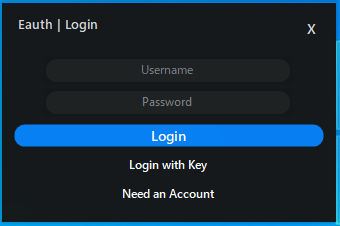

What is Eauth?
==============

https://eauth.us.to/ - Your #1 Free and Powerful Software Licensing Solution, Ultimately providing you with the most secure features and easy to use on an authentication system.    
  
Documentation
-------------

https://eauth.us.to/docs/


Configuration
-------------

Navigate to `Eauth.cs`, and fill these lines of code:

```c#
/* Required configuration */
private string accountKey = ""; //  account key goes here
private string applicationKey = ""; // Your application key goes here
private string applicationID = ""; // Your application ID goes here
private string applicationVersion = "1.0"; // Your application version goes here
```